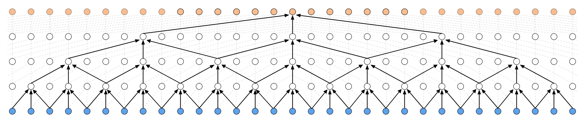
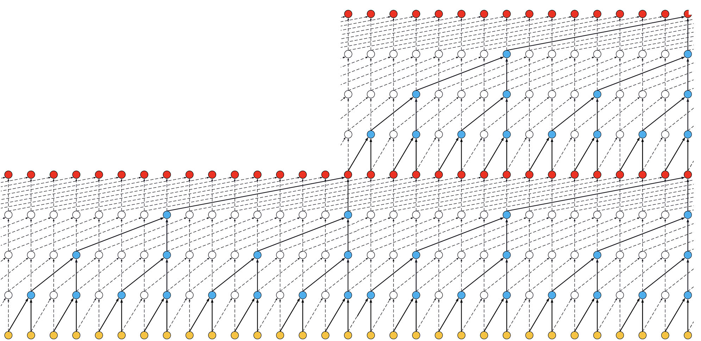
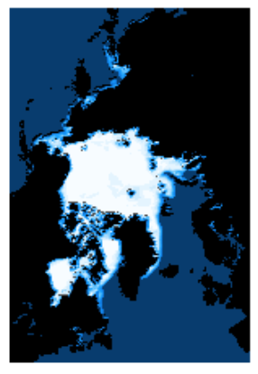
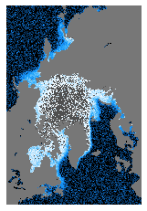
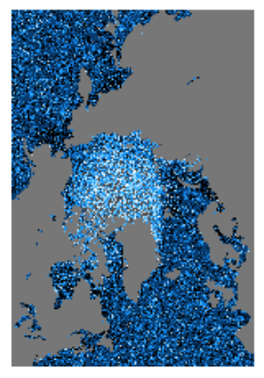

# Sea Ice Prediction
As a capstone project for my time in the Data Science Immersive program at the Chicago branch of the Flatiron School, I decided to try my hand at prediction of the extent and concentration of sea ice into the future. I have a strong urge to use the tools of data science and mathematics to help us predict the future health of our planet, and one of the most salient litmus tests we have is the health of the sea ice. Sometimes I find that it can be easy to get stuck behind a wall of numbers, especially as a data scientist, and as a result I wanted to attempt a more distinctive visual representation of the future predicted health of the sea ice through images.

## The Data
The data for this project comes directly from the National Snow and Ice Data Center ([website](https://nsidc.org)). In particular they have a data set called the [Sea Ice Index](https://nsidc.org/data/G02135/versions/3) which is an overview of the extent and concentration of sea ice around the world since 1978. The data are available as CSV files indicating extent in aggregate or as various different geographical files such as ESRI Shapefiles, GeoTiff files, or raw images. The data is available in both daily and monthly resolutions. For the purposes of this project, and its large data requirement, I opted to focus my attention on the daily GeoTiff files.

## Project Goals
This project aims to:
- Predict from previous image data the future boundary of sea ice
- Predict from previous image data the future concentration of sea ice
- Create interactive displays to see the progression of the prediction into future years
- Create an interactive system to see when certain conditions are met by sea ice in the predictive models.

## Project Structure
This project is broken up roughly into the following components:
- NSIDC Data Downloader: this class defines tools that can be used to download the needed GeoTiff raster files from the NSIDC FTP server
- GeoTiff Processor Class: this class defines tools that are used to extract the relevant information from GeoTiff files and preprocess this for use in our modeling.
- Ice Modeler Class: this class defines an extension of the Keras Sequential model incorporating time distributed layers and the needed temporal convolutional network structure.
- Modeling Notebooks: depending on how things pan out, there will be multiple jupyter notebooks that will make use of the aforementioned classes and scripts to import and process data, as well as perform the overall modeling.

## Project Dependecies:
This project requires the following dependencies:
- `Numpy`
- `Pandas` (for image indexing)
- `Matplotlib` (for image generation, specifically of concentration image files)
- `Rasterio` (for image processing and data extraction) -- to be removed in future versions, requires GDAL installation (which can be a pain)
- `Keras` and dependencies (for neural network modeling)
- `Keras-tcn` (special temporal convolutional network layer) -- downloaded from [Phillippe Remy's GitHub](https://github.com/philipperemy/keras-tcn) but also packaged in with this repository or available through `pip`.

In general I used Anaconda to install these libraries. Creating a virtual environment is a good idea specifically because of the Rasterio/GDAL dependencies.

## Model Overview
This project is essentially an attempt at tackling a scenario of the following fashion. First, the data that we are given is a time series of images that describes the development over time of a particular region or thing from the same perspective at regular intervals. In the case of this project that region is a well-defined region around the poles where sea ice forms, but we might imagine another scenario. Perhaps for instance we imagine a hypothetical dataset of images of a time series of agar plates with bacterial cultures. This type of architecture should theoretically be applicable in this case as well (though some adjustments will need to be made to abstract the actual model architecture away from sea ice, even though I tried to keep it as abstract as I could given the circumstances).

Since each image is a collection of pixels--in our case these "pixels" are single values that encode a concentration of sea ice for a given geographical region, but this data could also be greyscale or rgb images, or even just a collection of matrices which form a time-series--then we are afforded a decomposition of the overall time series of images to a series of parallel time-series of those individual pixels. Essentially the aim then is to perform a parallel time-series regression on this collection of pixel time-series to make predictions about their values in the future. In the context of sea ice, this means making predictions about future values of sea-ice concentrations for a given pixel (which corresponds to a geographic region). Reconstructing an image from these values depends on the specific context, but the NSIDC has a well-defined color map for translating between measured concentration values and RGB space (these are saved as pickled Python dictionaries in this project). 

I first intended to avoid a neural network approach and start with some more traditional time-series analysis methods (like SARIMA models) in this parallel regression. However, when you consider the fact that each of the images distributed by the NSIDC is 304x448 pixels, then this amounts to 136,192 parallel SARIMA models. It became clear that this would not be a particularly efficient approach, which was something that was important when considering the vast amount of data that was available.

In addition, the applicability of neural networks to image data is hard to ignore. In particular, spatial convolutional neural networks have been shown to be supremely effective in providing needed layers of abstraction to how a computer processes image data, much like humans. That being said, neural networks have also been shown to be quite effective at time-series analysis and predictive forecasting. In particular, standard methods make use of recurrent neural networks, in which network units feed back into themselves so as to use their current state as a paremeter for the next output. Some, such as LSTM variants (long short-term memory) have been found to be quite effective at storing long-term information for use in predictive analysis. However, given the general size of the parallel regression that is attempted in this project, these inefficient recurrent neural network approaches proved to be ineffective. As such, I was forced to turn to a more novel approach.

## Introducing the Temporal Convolutional Network
The temporal convolutional network is an alternative to the recurrent neural network approaches. Essentially a temporal convolutional network is a stack of progressively dilated convolutional filters applied to the temporal space with the condition that no future data is considered during the convolution. These styles of neural network layers have garnered a lot of recent attention as they offer significantly more efficiency than recurrent network layers while maintaining or even exceeding the performance of recurrent layers. Ultimately because I was using `Keras`, I had to find a suitable implementation of the temporal convolutional layer for `Keras`. Luckily Phillipe Remy has already written such a layer, and his work can be found [here](https://github.com/philipperemy/keras-tcn). His GitHub has a pretty good overview of what a temporal convolutional network can do. The `tcn` folder contained in this project is a direct download from his GitHub page (because I use Anaconda, installing this with `pip`, which is possible, is not a preferred option). I have provided a nice visual here (which is also directly from Phillipe Remy's GitHub page) which helps to illustrate what is happening in the stacks of "causal" convolutional layers which form the temporal convolutional network that only considers the past vs what happens in a "non-causal" architecture which can consider future events as well. Obviously for real-world work these types of models are not usable as we don't know future data.

By increasing the number of *residual blocks* we achieve the following effect

## Model Architecture and The IceModeler Class
Ultimately I decided on a combination of spatial and convolutional network layers in the final model architecture for this project. My implementation (which is held in the `IceModeler` class) is an extension of the `Keras` Sequential model which incorporates the temporal convolutional layers. An `IceModeler` class can be imported by using `from ice_modeler import IceModeler`. At instantiation, an `IceModeler` object can accept a tuple of integers which is the image size, but the default is what is provided by the NSIDC for concentration images. Much like a `Sequential` model, the `IceModeler` class can add layers. These layers include:
- Temporal Convolutional Layers
- Time-Distributed Layers:
    - Spatial Convolutional Filters
    - Reshape to Image
    - Reshape to Flattened
    - Densely Connected
- Also like the `Sequential` model, the IceModeler class has compilation, fitting, and predicting methods. In addition, the class implements a method to predict the next *n* years based on the given known year by successively bootstrapping predictions.

## Some Resultant Images
First, I started by just testing out some spatial convolutional filtering, which is seen in the following image

Then, I tested only temporal convolutional filtering, which resulted in the following image

A combination of the two produces the following style of predicted images

## To-Do
Obviously, given the current results, we still have some tuning of hyperparameters to ensure that we have a sufficient model. It seems mostly like the central areas of the North pole have the issue of being identified as land regions in the eventual color mapping. Theoretically this could be due to the neural network architecture and the regions which have been identified as land or able to have sea ice. Hence, the following are important priority items:
- Find a different method by which we can have the model learn which regions are land or not
    - One idea is to have the model learn two outputs: one for the sea ice concentrations and another for land vs not land regions
    - If all land vs not-land region masks are the same, then perhaps we can safely assume this same mask for future predictions? This obviously does not consider long-form geographical changes in land area, but in general the time-scales we are dealing with in this project are short in comparison to geological time-scales.
- Find a better mapping between the model output space and the associated color mapping. This might be related to the previous quesiton.
- Attempt for the South Pole.
- Make prediction video/gif

## Links
- [NSIDC Website](https://nsidc.org)
- [Sea Ice Index](https://nsidc.org/data/G02135/versions/3)
- [About Sea Ice](https://nsidc.org/cryosphere/seaice/index.html)
- [Phillipe Remy's Keras-TCN](https://github.com/phillipp)
- [My Blog Post](https://baileybjornstad.squarespace.com/blog/at-the-icy-fringe)
- [Summary Blog Post](https://baileybjornstad.squarespace.com/blog/sweetened-condensed-ice)
